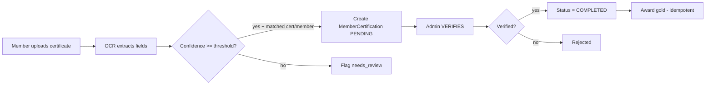
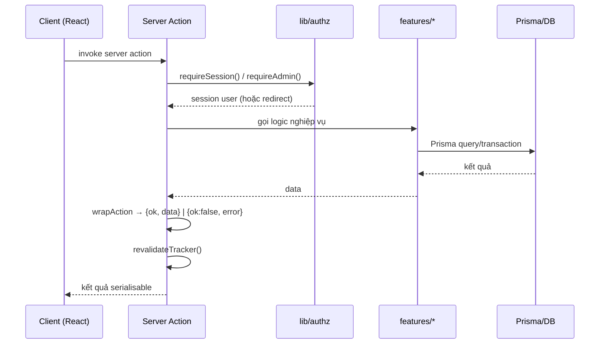
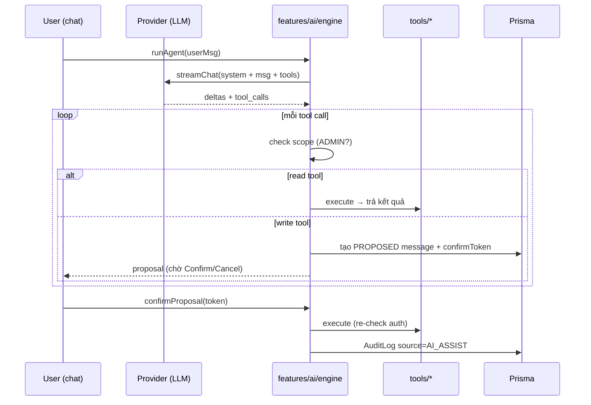

# Certification Tracker — Kiến trúc hệ thống

> Tài liệu này mô tả kiến trúc của ứng dụng **Certification Tracker** — một monolith
> Next.js full-stack dùng để quản lý kế hoạch chứng chỉ của nhân viên nội bộ.
> Nguồn: phân tích trực tiếp mã nguồn trong repo (nhánh `main`).

---

## 1. Tổng quan

Ứng dụng trả lời các câu hỏi nghiệp vụ: chứng chỉ nào có sẵn / bắt buộc / được khuyến nghị,
ai cần chứng chỉ nào, deadline ra sao, ai đã hoàn thành / đang học / chưa bắt đầu / quá hạn,
ai cần nhắc nhở, và tỷ lệ tuân thủ (compliance) tổng thể.

Kiến trúc là một **monolith Next.js duy nhất** — không có backend riêng, không microservices,
không Redis, không message queue.

```
                     Microsoft Entra ID (OAuth)
                            │
                            ▼
        ┌──────────────────────────────────────────────┐
        │            Next.js 15 Application            │
        │  React UI · Server Components · Server        │
        │  Actions · Route Handlers · Auth · Biz logic  │
        │                                               │
        │   ┌───────────────┐  ┌────────────────────┐   │
        │   │  Prisma ORM   │  │  AI Assist (LLM)   │   │
        │   └───────┬───────┘  └─────────┬──────────┘   │
        └───────────┼────────────────────┼──────────────┘
                    │                    │ (Python subprocess cho OCR)
        ┌───────────┴──────────┐         │
        ▼                      ▼         ▼
   SQLite (file:dev.db)   Azure Blob      EasyOCR
   (MVP)                  Storage         (tuỳ chọn)
```

---

## 2. Tech stack

| Thành phần | Công nghệ |
| --- | --- |
| Framework | Next.js 15 (App Router) + React 19 + TypeScript |
| Styling | Tailwind CSS + shadcn/ui (Radix primitives) |
| Auth | Auth.js (next-auth v5) — Microsoft Entra ID + dev-login |
| Database | Prisma ORM — **SQLite (MVP)**, có thể nâng lên PostgreSQL khi scale |
| File storage | Azure Blob Storage (SAS URL) / local-filesystem fallback |
| Validation | Zod |
| AI Assist | Provider abstraction (openai-compatible / azure-openai / Gemini) |
| OCR | Pluggable: `stub` (dev) hoặc EasyOCR qua Python subprocess |
| Test | Vitest (unit) + Playwright (E2E) |

> **Lưu ý:** `prisma/schema.prisma` hiện khai báo `provider = "sqlite"`, trong khi
> `docker-compose.yml` và `.env.example` dùng PostgreSQL. Xem mục 9 (điểm cần lưu ý).

---

## 3. Cấu trúc thư mục

```
src/                          ← thư mục mã nguồn CHÍNH (active, theo tsconfig @/* → ./src/*)
├── app/                      ← App Router (pages + route handlers)
│   ├── (app)/                ← nhóm trang có layout đã đăng nhập
│   │   ├── admin/            ← trang admin (dashboard, members, certifications, reports…)
│   │   ├── dashboard/        ← kế hoạch chứng chỉ của member
│   │   ├── my-certifications/
│   │   ├── leaderboard/
│   │   └── recommended/
│   ├── api/                  ← route handlers
│   │   ├── ai/chat/          ← streaming AI chat
│   │   ├── auth/[...nextauth]/ ← Auth.js handlers
│   │   ├── certificates/extract/ ← OCR extraction
│   │   └── files/            ← blob download + local upload
│   ├── login/                ← trang đăng nhập
│   └── page.tsx              ← trang chủ (redirect)
├── components/
│   ├── ui/                   ← shadcn/ui primitives
│   └── features/             ← component nghiệp vụ (ai-chat, nav, ocr-extract-panel…)
├── features/                 ← LOGIC NGHIỆP VỤ (domain modules)
│   ├── ai/                   ← AI Assist (engine, provider, tools, prompt)
│   ├── assignments/          ← gán chứng chỉ, trạng thái hiệu lực
│   ├── audit/                ← AuditLog
│   ├── certifications/       ← CRUD + import chứng chỉ
│   ├── compliance/           ← tính compliance
│   ├── dashboard/            ← truy vấn dashboard
│   ├── files/                ← storage abstraction (azure/local)
│   ├── gold/                 ← gold rewards (award, ledger)
│   ├── ocr/                  ← OCR extraction
│   ├── progress/             ← cập nhật tiến độ
│   ├── recommended/          ← chứng chỉ khuyến nghị
│   ├── reminders/            ← nhắc nhở + notification service
│   ├── reports/              ← truy vấn báo cáo
│   ├── config.ts             ← đọc env config tập trung
│   ├── dates.ts              ← helper ngày tháng
│   └── schemas.ts            ← Zod schemas
├── lib/                      ← hạ tầng dùng chung (core)
│   ├── auth.ts               ← cấu hình NextAuth
│   ├── authz.ts              ← requireSession / requireAdmin
│   ├── prisma.ts             ← PrismaClient singleton
│   ├── server-action.ts      ← wrapAction / revalidateTracker
│   └── utils.ts              ← cn()
├── middleware.ts             ← bảo vệ route (NextAuth middleware)
prisma/
├── schema.prisma             ← data model
└── seed.ts                   ← seed dữ liệu demo
scripts/cert_ocr/             ← Python EasyOCR extractor (tuỳ chọn)
tests/                        ← unit + e2e tests
```

> **Cảnh báo:** repo hiện có **hai cây mã song song** — `app/`, `components/`, `features/`,
> `lib/` ở gốc **và** `src/app/`, `src/components/`, `src/features/`, `src/lib/`. Theo
> `tsconfig.json` (`@/* → ./src/*`) và quy ước Next.js (ưu tiên `src/app`), cây **`src/` là
> cây hoạt động**. Cây ở gốc là bản sao cũ/stale và nên được dọn (xem mục 9).

---

## 4. Phân lớp kiến trúc

Phân tích đồ thị mã nguồn cho thấy 4 lớp rõ ràng:

```
┌─────────────────────────────────────────────────────────────┐
│  LỚP ENTRY (UI + route handlers)                             │
│  src/app/**  ·  src/components/**                            │
│  → gọi xuống features/lib, không có inbound                   │
├─────────────────────────────────────────────────────────────┤
│  LỚP DOMAIN (logic nghiệp vụ)                                │
│  src/features/**  (assignments, gold, ocr, reminders, …)     │
│  → phụ thuộc lib (core), được app gọi vào                     │
├─────────────────────────────────────────────────────────────┤
│  LỚP CORE (hạ tầng dùng chung)                               │
│  src/lib/**  (auth, authz, prisma, server-action)            │
│  → fan-in cao nhất, không gọi ra ngoài                        │
├─────────────────────────────────────────────────────────────┤
│  LỚP DATA                                                    │
│  SQLite · Azure Blob Storage · (EasyOCR)                     │
└─────────────────────────────────────────────────────────────┘
```

**Hotspots (điểm nóng, fan-in cao):**

| Symbol | Vai trò | Fan-in |
| --- | --- | --- |
| `wrapAction` (`lib/server-action`) | Bọc server action, trả `{ok, error}` | 72 |
| `requireAdmin` (`lib/authz`) | Chặn non-admin | 54 |
| `revalidateTracker` (`lib/server-action`) | Revalidate cache các trang tracker | 52 |
| `requireSession` (`lib/authz`) | Yêu cầu đăng nhập | 48 |
| `logAudit` (`features/audit/log`) | Ghi AuditLog | 40 |

---

## 5. Data model (Prisma)

Các domain cốt lõi:

```
User ──< CertificationAssignment >── Certification
  │              │  (member + cert + type + deadline + status)
  │              └──< ReminderLog
  └──< MemberCertification >── Certification
         │  (status, progress, verificationStatus, files)
         └──< CertificateFile ──< CertificateExtraction
  └──< GoldTransaction (append-only ledger, balance DERIVED)
  └──< AuditLog
  └──< AiConversation ──< AiMessage
```

**Ý tưởng then chốt:**

- **`Certification`** = chứng chỉ là gì (VD AZ-204). **`CertificationAssignment`** = một member
  cụ thể phải làm gì (John + AZ-204 + REQUIRED + deadline). Hai member có thể có deadline khác
  nhau cho cùng chứng chỉ.
- **`MemberCertification`** = tiến độ học + kết quả + file chứng chỉ + trạng thái xác minh.
- **`GoldTransaction`** = sổ cái append-only; **balance là giá trị suy ra** (SUM), không lưu trực tiếp.
- **Trạng thái là suy ra (derived), không sửa tay** — `getEffectiveStatus()` tính
  `NOT_STARTED / IN_PROGRESS / COMPLETED / OVERDUE / EXEMPTED / CERTIFICATE_EXPIRED`.

**Luồng nghiệp vụ chính:**



---

## 6. Luồng dữ liệu & luồng điều khiển

### 6.1 Request điển hình (Server Action)



### 6.2 AI Assist (Module A) — human-in-the-loop



An toàn: LLM **không bao giờ chạm DB trực tiếp**; chỉ phát ra tool calls mà **server** thực thi
sau khi kiểm tra quyền. Tool ghi phải được admin **Confirm** thì mới chạy.

### 6.3 File storage (abstraction)

`features/files/storage.ts` định nghĩa interface `FileStorage` với 2 triển khai:

| Triển khai | Upload | Download | Khi nào dùng |
| --- | --- | --- | --- |
| `AzureBlobStorage` | PUT lên SAS URL (15 phút) | SAS URL đọc (15 phút) | `FILE_STORAGE=azure` (prod) |
| `LocalFileStorage` | POST `/api/files/local-upload` | GET `/api/files/blob/...` | `FILE_STORAGE=local` (dev) |

`getFileStorage()` chọn theo `config.fileStorage`. File **không** lưu trong PostgreSQL.

### 6.4 Reminders

Nhắc nhở **thủ công** (manual). Ngăn gửi trùng trong `REMINDER_COOLDOWN_HOURS`. Delivery qua
interface `NotificationService` (`ConsoleNotificationService` dev / `ResendNotificationService`
prod) → dễ thêm Teams/in-app sau.

---

## 7. Bảo mật & uỷ quyền

- **Middleware** (`src/middleware.ts`) bảo vệ toàn bộ route trừ `api/auth`, `_next`, static, `login`.
- **Server-side enforcement**: `requireSession()` / `requireAdmin()` trong `lib/authz.ts` được gọi
  ở mọi server action / page / route handler.
- **Cross-member**: member chỉ đụng dữ liệu của chính mình; admin làm mọi thứ.
- **AI**: tool write cần confirm; role-scoping ở cả registry lẫn lúc execute.
- **Secrets**: `.env` bị gitignore; không commit secret.

---

## 8. Các module feature (chi tiết)

| Module | Trách nhiệm | File chính |
| --- | --- | --- |
| `assignments` | Gán chứng chỉ, tính trạng thái hiệu lực | `effective.ts`, `status.ts`, `actions.ts` |
| `certifications` | CRUD catalog, import CSV | `actions.ts`, `import-actions.ts` |
| `compliance` | Tính compliance từ assignments | `calculate.ts` |
| `gold` | Award idempotent, sổ cái, balance | `award.ts`, `actions.ts` |
| `ocr` | Extract chứng chỉ từ ảnh, confidence gate | `service.ts`, `extraction.ts`, `rules.ts` |
| `reminders` | Nhắc nhở + notification | `actions.ts`, `notification.ts`, `rules.ts` |
| `reports` | Truy vấn báo cáo admin | `queries.ts` |
| `departments` | 部署 phân cấp (path), CRUD, import CSV, sync Entra | `service.ts`, `queries.ts`, `actions.ts`, `import-actions.ts`, `entra-sync.ts` |
| `dashboard` | Truy vấn dashboard member/admin | `queries.ts` |
| `ai` | Agent loop, provider, tools | `engine.ts`, `provider.ts`, `tools/*` |
| `audit` | Ghi AuditLog | `log.ts` |

---

## 9. Điểm cần lưu ý (tech debt / rủi ro)

1. ~~**Cây mã trùng lặp**~~ — **Đã dọn (CR-DEPT-01).** Trước đây tồn tại cả `app/`, `components/`,
   `features/`, `lib/` (gốc) và `src/...`. Cây `src/` là active; cây gốc stale đã được xoá để
   build chạy được.
2. **DB dùng SQLite cho MVP** (đã thống nhất): `schema.prisma` khai `provider = "sqlite"`
   với `DATABASE_URL="file:./dev.db"`. Không cần Docker/PostgreSQL. Khi scale lên production,
   đổi sang PostgreSQL và cập nhật lại `docker-compose.yml` + `.env.example`.
3. **`.env.example` có placeholder bị REDACTED** (giá trị mẫu) — cần điền lại cho dev mới.
4. **AI/OCR cần key/engine riêng** — không chạy "thật" nếu thiếu `AI_API_KEY` / `OCR_ENGINE=easyocr`.

---

## 10. Module Department (CR-DEPT-01)

Phân cấp 部署 dùng **materialized path** (`path = "ORG/DIV-A/DEPT-1"`, unique) kết hợp
`parentId` (self-relation). Lọc member theo cả cây con bằng `path startsWith`.

- **Đồng bộ Entra**: khi login company account, `lib/auth.ts` gọi Graph `/me` (scope
  `User.Read`) → `syncUserDepartmentFromEntra`. Manual override (`departmentLocked`) không bị
  ghi đè; `entraDepartmentRaw` luôn được lưu.
- **Import CSV / nhập tay**: member mới để `entraObjectId = "pending:<email>"`, khớp khi login
  lần đầu theo email (không tạo user thứ 2).
- **Mã 部署 thật không hardcode** — chỉ nạp qua Entra/CSV/nhập tay lúc chạy; seed dùng placeholder.
- Feature-flag: `FEATURE_DEPARTMENTS`.

---

## 11. Cách chạy

```bash
cp .env.example .env          # điền AUTH_SECRET, ...
npm install
npx prisma migrate dev        # (hoặc npm run db:push) — SQLite, không cần Docker
npm run db:seed
npm run dev                   # http://localhost:3000
```

Test: `npm test` (unit) · `npm run test:e2e` (Playwright, cần DB + seed + dev login).